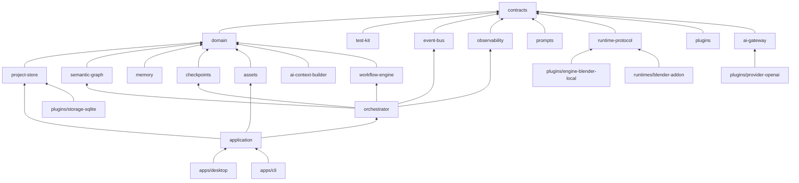
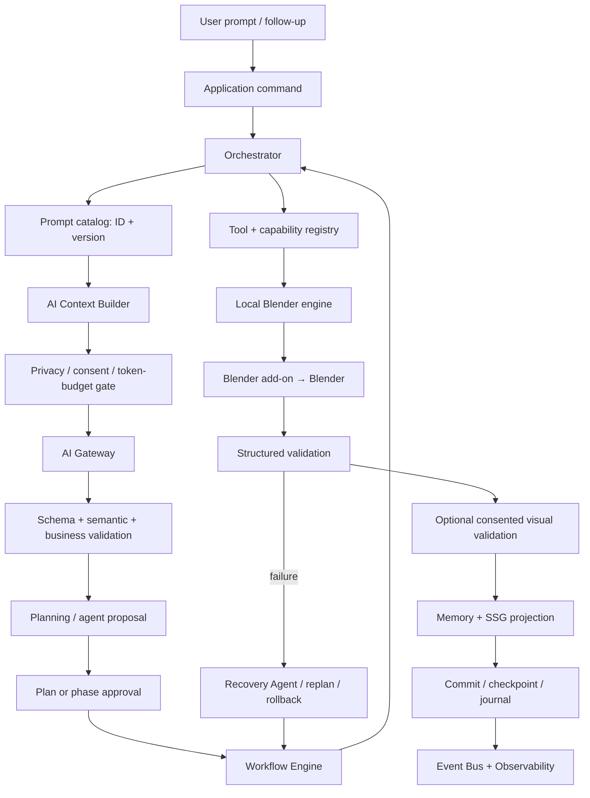

# AI3D Studio — Version 1 Implementation Blueprint

**Status:** Approved architecture translated into an implementation plan  
**Scope:** Version 1 only; no implementation source code is defined by this document.  
**Prerequisite:** [Version 1 Software Architecture Specification](version-1-software-architecture-specification.md)

## Purpose

This blueprint converts the approved architecture into a build sequence. It defines package boundaries, contracts to design, data ownership, test gates, and milestone exit criteria. It deliberately does not prescribe TypeScript or Python implementations.

## 1. Repository Plan

```text
ai3d-studio/
  apps/
    desktop/                 primary Windows product shell and presentation client
    cli/                     automation, diagnostics, CI, and developer client
  packages/
    contracts/               versioned cross-package schemas and compatibility rules
    domain/                  engine-neutral business concepts and policy primitives
    application/             client-facing commands, queries, use-case coordination
    event-bus/               typed in-process publication and subscriptions
    workflow-engine/         deterministic task/phase state machines and dependency runner
    orchestrator/            execution policy, approvals, agent assignment, recovery coordination
    prompts/                 immutable versioned first-party prompt assets and catalog
    ai-context-builder/      context selection, minimization, consent, token budgeting
    ai-gateway/              provider/model routing, structured invocation, usage normalization
    observability/           tracing, metrics, cost accounting, structured local diagnostics
    semantic-graph/          semantic world model service and persistence abstractions
    memory/                  project/global/cross-project scoped memory service
    project-store/           project lifecycle, repositories, manifest, migrations
    checkpoints/             full snapshot lifecycle, restoration, retention, journal support
    assets/                  libraries, indexing, semantic search, imports, relinking, packaging
    plugins/                 manifests, discovery, lifecycle, capability registration
    runtime-protocol/        versioned controller/runtime handshake and message contracts
    test-kit/                fixtures, contract suites, fakes, fault injection, test helpers
  plugins/
    agent-planning/          plan and clarification proposal provider
    agent-modeling/          geometry/transform/collection proposal provider
    agent-assets/            asset lookup/import proposal provider
    agent-material-lighting/ material, lights, cameras proposal provider
    agent-validation/        structured and visual validation proposal provider
    agent-recovery/          failure analysis and recovery proposal provider
    engine-blender-local/    local execution-engine adapter and runtime client
    provider-openai/         initial AI Gateway provider adapter
    storage-sqlite/          SQLite/Drizzle persistence implementation
    assets-filesystem/       project/global filesystem asset provider
  runtimes/
    blender-addon/           thin Blender-resident execution host
  docs/
    architecture/            approved architecture and blueprint
    adr/                     architecture decision records
    contracts/               human-readable contract references
    runbooks/                support, migration, recovery, release operations
  tests/
    e2e/                     installed-system workflows
    acceptance/              representative scene scenarios
    performance/             benchmark suites and baselines
  tooling/                   repository-only quality, release, fixture, and documentation tooling
```

### Folder rationale

`apps` contains clients only; it must contain no business rules. `packages` contains framework-independent core modules. `plugins` contains replaceable first-party implementations loaded through the plugin contract. `runtimes` isolates Blender Python and keeps Blender-specific behavior out of the Node/TypeScript core. `tests` holds system suites that must not be coupled to one package. `docs` is versioned engineering knowledge; `tooling` is non-product development support.

## 2. Package Dependency Order

### Rules

- `contracts` is the common vocabulary and has no product-package dependency.
- `domain` depends only on contracts.
- Application and core services depend inward on domain/contracts and outward through ports only.
- Plugins depend on contracts and the specific ports they implement; core packages never import a concrete plugin.
- Apps depend on application contracts; runtime add-on depends only on runtime protocol and Blender APIs.



### Build order

1. Contracts, test kit, repository conventions.
2. Domain, event bus, observability, prompts.
3. Project store, SQLite plugin, plugin manager, runtime protocol.
4. Workflow engine, checkpoints, SSG, memory, assets.
5. Context builder, AI gateway, OpenAI plugin, planning/validation/recovery contracts.
6. Blender add-on and local Blender engine.
7. Orchestrator and application facade.
8. First-party agents, CLI, desktop client, installer and system tests.

## 3. Development Roadmap

| Milestone                    | Objective / packages                                                                  | Complexity & risks                            | Outputs                                                      | Required tests                                                 |
| ---------------------------- | ------------------------------------------------------------------------------------- | --------------------------------------------- | ------------------------------------------------------------ | -------------------------------------------------------------- |
| M0: Foundation               | Workspace conventions, `contracts`, `test-kit`, quality gates                         | Medium; contract churn                        | build graph, schema/version policy, fixtures                 | contract parsing, package boundary checks                      |
| M1: Local project kernel     | `domain`, `project-store`, SQLite plugin, `plugins`, `event-bus`, `observability`     | High; migration/transaction correctness       | create/open/read-only lock, manifest, local journal/logs     | units, SQLite integration, lock/crash simulations              |
| M2: Blender connectivity     | `runtime-protocol`, Blender add-on, local engine                                      | High; Blender context/version behavior        | authenticated handshake, health, observation, typed metadata | protocol contracts, live Blender runtime tests                 |
| M3: Deterministic execution  | tool/capability registry, `workflow-engine`, checkpoints, initial tools               | Highest; partial execution and rollback       | phase state machine, pause/cancel/retry, snapshots/restore   | units, integration, fault injection, checkpoint recovery       |
| M4: Project intelligence     | SSG, identity, passports, memory, assets                                              | High; sync accuracy and ownership transitions | re-index, scene delta processing, asset search/import        | graph units, repository integration, sync scenarios            |
| M5: AI planning loop         | prompts, context builder, gateway, OpenAI plugin, planning/recovery/validation agents | High; output safety, cost, privacy            | validated plan/clarification/recovery pipeline               | fake-provider units, schema/semantic validation, consent tests |
| M6: End-to-end orchestration | orchestrator, application, agents, visual validation                                  | Highest; cross-package state consistency      | approved plan → phase execution → validation → recovery      | E2E scenes, manual edit, failure/replan, cost tests            |
| M7: Productization           | desktop, CLI, updater/install lifecycle, acceptance/performance/security hardening    | High; operational reliability                 | usable local app/CLI and release artifacts                   | installer, compatibility, performance, acceptance, security    |

Every milestone is independently buildable: it ends with executable tests and a demonstrable behavior, not just new types or empty package folders.

## 4. Package-by-Package Plan

The following is the minimum delivery plan for every package. “Events” means emitted/subscribed typed events, never uncontrolled in-process objects.

| Package                               | Responsibilities and public surface                                                                                                                        | Internal plan                                                                               | Tests                                                                          |
| ------------------------------------- | ---------------------------------------------------------------------------------------------------------------------------------------------------------- | ------------------------------------------------------------------------------------------- | ------------------------------------------------------------------------------ |
| `contracts`                           | Versioned command/query/event, agent response, tool, plugin, protocol, error, and persistence DTO schemas.                                                 | schema registry, compatibility policy, IDs/envelopes, validator facade.                     | valid/invalid fixtures, compatibility matrix, serialization round trips.       |
| `domain`                              | Entities/value objects: Project, Execution, Phase, Task, Checkpoint, Asset, Passport; risk/ownership and transition policies.                              | aggregates, pure services, domain errors, invariants. No repositories or I/O.               | exhaustive state/risk/invariant tests.                                         |
| `application`                         | Client commands: open/create/import project, execute prompt, approve/pause/resume/cancel, checkpoint/restore/package; read models and event subscriptions. | command handlers, authorization/lock preconditions, unit-of-work boundary, DTO mappers.     | command integration with fakes; client contract tests.                         |
| `event-bus`                           | `publish`, `subscribe`, `unsubscribe`; ordered execution-stream notification after commit.                                                                 | dispatcher, subscriptions, isolation, diagnostics.                                          | ordering, failure isolation, unsubscribe, correlation tests.                   |
| `workflow-engine`                     | State machines, dependency readiness, retries/backoff, timeout, pause/resume/cancel.                                                                       | workflow definitions, transition guard, scheduler, attempt tracker, workflow errors.        | table-driven transitions, dependency graphs, retry/cancel races.               |
| `orchestrator`                        | Business coordination: agent selection, approval policy, recovery decisions, task dispatch, synchronization, rollback coordination.                        | execution service, approval gate, agent router, workflow adapter, event projector.          | integration with fake workflow/agents/runtime; policy scenarios.               |
| `prompts`                             | Resolve immutable prompt ID/version compatible with agent/schema; record provenance.                                                                       | prompt catalog, prompt metadata, compatibility resolver, evaluation links.                  | version selection, immutability, invalid-variable/schema tests.                |
| `ai-context-builder`                  | Build minimal authorized context manifest for each agent model call.                                                                                       | scope resolver, relevance selector, SSG summarizer, consent/redaction gate, token budgeter. | privacy boundary, deterministic selection, truncation, disclosure tests.       |
| `ai-gateway`                          | Provider-neutral structured invocation, model routing, repair/retry boundary, usage normalization.                                                         | route policy, request executor, output validator adapter, provider errors.                  | fake provider, timeout/retry, usage/cost normalization, no-secret logs.        |
| `observability`                       | Local traces, metrics, structured logs, cost records, exports.                                                                                             | correlation context, sinks, redaction, metric/cost aggregation, query API.                  | redaction, correlation propagation, metric/cost accuracy, export review tests. |
| `semantic-graph`                      | SSG commands/queries, graph consistency, observed-delta projection.                                                                                        | node/edge/property/constraint repositories, projector, query service, graph errors.         | role/edge/constraint/version tests and SQL integration.                        |
| `memory`                              | Project memory isolation, global preferences, optional cross-project learning and disclosure.                                                              | scoped repositories, retrieval policy, retention/deletion service.                          | cross-project leakage, consent, CRUD/retention tests.                          |
| `project-store`                       | Project folder/manifest, repositories, migrations, locks, transaction coordination.                                                                        | repository interfaces, migration planner, lock manager, journal adapter.                    | migration/rollback, lock contention, corruption/recovery tests.                |
| `checkpoints`                         | Full checkpoint create/list/verify/restore/retention; couples scene and DB atomically.                                                                     | artifact staging, checksum, retention, restore coordinator, checkpoint errors.              | interrupted copy, checksum failure, retention, scene+DB restore tests.         |
| `assets`                              | libraries, async index, semantic search, import/relink/package.                                                                                            | provider port, indexer, metadata/preview workers, package planner.                          | filesystem fixture libraries, hash/relink, linked/copy/package tests.          |
| `plugins`                             | manifest validation, discovery, dependency resolution, lifecycle, capability registration.                                                                 | loader, resolver, lifecycle coordinator, health/compliance runner.                          | missing/cyclic/incompatible dependency, activation rollback tests.             |
| `runtime-protocol`                    | authenticated versioned messages, handshake, transport-neutral client/server interfaces.                                                                   | envelope validation, session/token/nonce primitives, codec, protocol errors.                | malformed/replay/version/correlation/idempotency tests.                        |
| `test-kit`                            | fakes for engine/provider/clock/store, fixtures, fault injection, shared assertions.                                                                       | scene fixtures, fake event collector, deterministic scheduler, test project builder.        | test-kit self-tests and contract conformance.                                  |
| Agent plugins                         | Propose only validated domain-specific work; never execute directly.                                                                                       | prompt resolution, context request, gateway call, response validator.                       | prompt/schema fixtures, tool proposal safety, failure reports.                 |
| Engine/provider/storage/asset plugins | Implement their respective ports and capability manifests.                                                                                                 | adapter-specific mappers and error translators.                                             | shared compliance suite plus adapter integration tests.                        |
| `apps/desktop`                        | Presentation: conversation, approvals, timeline, recovery, settings, project UI.                                                                           | view models, command/query/event adapters only.                                             | UI flows using application fakes; accessibility tests.                         |
| `apps/cli`                            | automation/CI commands and structured output.                                                                                                              | command parsing, application composition, exit mapping.                                     | command integration, read-only/write-lock behavior.                            |
| Blender add-on                        | Runtime command dispatch, Blender metadata/scene observation, progress and error reporting.                                                                | session host, observer, typed tool dispatcher, Blender-version adapter.                     | live Blender test suite, manual context regression tests.                      |

### Common internal design vocabulary

- **Commands:** intent-changing application/domain requests; always versioned, correlated, and validated.
- **Queries:** read-only requests returning stable read models; no side effects.
- **Repositories:** interfaces near domain/application ports; SQLite implementation lives only in the storage plugin.
- **Services:** domain/application operations that do not naturally belong to one entity.
- **Factories:** create aggregates and validated request/result envelopes, never perform I/O.
- **Errors:** typed, safe-to-display categories with retryability, causal reference, remediation, and correlation ID.

## 5. Database Plan

### Database split

Each project owns `project.db`; a separate application SQLite database owns user-wide settings, recent projects, global libraries, installed-plugin metadata, and optional local learnings. `.blend` remains the 3D source of truth.

### Logical schema and relationships

| Area                   | Tables and key relationships                                                                                                                                                             |
| ---------------------- | ---------------------------------------------------------------------------------------------------------------------------------------------------------------------------------------- |
| Project/lifecycle      | `projects` → `project_settings`, `project_locks`, `project_manifest_history`; one active writer lock per project.                                                                        |
| Plans/workflow         | `plans` → `plan_revisions` → `phases` → `tasks`; `task_dependencies` links tasks; attempts/approvals/events reference execution, phase, task.                                            |
| Journal/observability  | `execution_journal`, `execution_events`, `tool_executions`, `trace_spans`, `metric_samples`, `cost_usage`, `structured_logs`; all correlate by execution and request IDs where relevant. |
| SSG/provenance         | `semantic_nodes` ↔ `semantic_edges`; properties/constraints/version history reference node; passports/version history reference stable Blender object ID.                                |
| Context/prompts/memory | prompt assets → versions/evaluations; context manifests/disclosures reference invocation; conversation/messages and memory records are project-scoped.                                   |
| Assets                 | libraries → assets → metadata/tags/dependencies/previews; `asset_imports` connects assets to project/scene objects.                                                                      |
| Recovery/migration     | checkpoints → artifacts/restores; validation reports/findings; recovery plans/attempts; migrations/migration runs.                                                                       |

### Migration order

1. Project manifest and migration ledger.
2. Core project/settings/lock tables.
3. Plans, workflow, approvals, journal.
4. SSG, identity, passport, constraints.
5. Checkpoint/recovery and validation.
6. Memory, prompts, context manifests/disclosures.
7. Assets/search indexes.
8. Observability/cost tables.
9. Plugin/runtime capability records.

Every migration is versioned, deterministic, idempotent where safe, independently testable, and invoked only after approval and full pre-migration checkpoint. The migration ledger must commit atomically with each migration step.

### Indexes

- Primary/unique IDs on all aggregates and object identifiers.
- Foreign-key indexes for execution/phase/task, semantic node/edge, asset/library, checkpoint/project, and correlation IDs.
- Composite indexes for active writer lock, task readiness/state, execution timeline ordering, object ID plus passport version, and prompt ID/version.
- Search indexes/FTS for asset name/tags/description/AI metadata; do not introduce external search in Version 1.
- Time-range indexes for logs, traces, metrics, cost, checkpoints, and journal events.

### Transaction boundaries

- A command changes its authoritative project-store state in one SQLite transaction.
- Workflow transitions and journal entries commit together before event publication.
- Phase checkpoint creation stages and verifies artifacts before recording a usable checkpoint.
- Restore replaces matching `.blend` and DB artifacts as one recovery operation, followed by integrity validation.
- Asset indexing uses small independent transactions and never holds the project execution write transaction.
- Runtime/tool side effects cannot be made atomic with SQLite; compensate through pre-phase checkpoints, idempotency keys, observed-scene validation, and rollback.

## 6. Blender Runtime Plan

### Components

1. **Add-on bootstrap:** install/enable/version reporting; no business logic.
2. **Session host:** localhost endpoint, token/nonce validation, session expiry, heartbeat.
3. **Capability reporter:** Blender/add-on/protocol version and supported typed tools.
4. **Typed tool dispatcher:** maps allowlisted tool IDs to version-adapted Blender operations.
5. **Scene observer:** batches meaningful user/AI deltas and distinguishes non-scene UI changes.
6. **Metadata extractor:** objects, transforms, hierarchy, materials, modifiers, lights, cameras, collections, validation facts.
7. **Progress/error reporter:** structured status, safe errors, correlation IDs.
8. **Snapshot adapter:** create/load verified scene artifacts for checkpoint/restore coordination.

### Lifecycle

Desktop/CLI discovers supported Blender → installs or validates bundled add-on → controller starts/connects → authenticated handshake and capability negotiation → project obtains engine session → execution/observation occurs → disconnect/heartbeat/reconnect handled → project session closes cleanly. An unsupported Blender/add-on/protocol combination stops with actionable diagnostics.

### Synchronization

Observer emits batched `SceneDelta` events. Local engine normalizes them; Identity Service resolves `ai3d.objectId`; Semantic Graph projector and Passport service update project intelligence; orchestrator asks Workflow Engine which remaining tasks are affected. Mode policy decides whether to continue, pause, revalidate, or request approval. Manual full re-index reconstructs derived metadata without treating the store as geometry authority.

### Execution

Only a validated tool request reaches the dispatcher. The add-on validates session/protocol/tool support and request shape, performs the bounded Blender operation, gathers observed result metadata, and returns a typed result. It never accepts raw scripts or generic Blender operators. The engine applies timeouts/cancellation semantics and uses idempotency/correlation identifiers to avoid duplicate effects after transport uncertainty.

## 7. AI Execution Pipeline



### Pipeline rules

1. Prompt assets are resolved by ID/version before context assembly.
2. Context Builder creates and persists the exact input manifest; Gateway does not own retrieval.
3. Gateway returns only structured, validated agent output; LLM text never controls runtime behavior directly.
4. Planner determines _what_ is proposed; Orchestrator applies policy and agent selection; Workflow Engine determines valid execution transitions and ready dependencies.
5. Runtime performs typed side effects; validation observes results; SSG/memory record derived knowledge; checkpoints protect phase consistency.
6. Observability receives normalized events and usage after authoritative state is recorded; it does not control execution.

## 8. Testing Strategy

### Unit testing

Every package tests pure domain policies and module-level error paths. Required examples: state transitions, retry calculations, risk/ownership classification, prompt resolution, context inclusion/exclusion, provider output repair, graph constraints, identity heuristics, migration planning, retention, plugin resolution, and redaction. Use deterministic clocks, IDs, schedulers, and fake providers/engines from `test-kit`.

### Integration testing

Test port/adapter pairs: repositories with SQLite; stores with migrations/locks; SSG with repository; asset service with fixture library; Gateway with fake provider; Context Builder with memory/SSG; Workflow with orchestrator; checkpoint store with real filesystem staging; local engine with protocol test server. These tests prove transaction boundaries and contract compatibility.

### Runtime testing

Run an automated Blender test harness against the pinned supported release. Verify add-on install/enable, handshake, capability discovery, every initial typed tool, progress/results/errors, metadata extraction, scene deltas, snapshots, cancellation, runtime restart, and version rejection. Keep a small curated `.blend` fixture corpus for context-sensitive Blender regressions.

### Recovery testing

Inject controller crash, Blender crash, process kill, timeout, network disconnect, duplicate request, corrupted checkpoint, failed migration, lock abandonment, and partial asset copy. Assert that committed work remains available, matching scene/DB artifacts are restored, stale locks are safe, and recovery UI options are accurate.

### End-to-end and acceptance testing

Automate: create/open/import; plan/clarify/approve; phase execution; manual edit synchronization; checkpoint/rollback; close/reopen; follow-up edit; linked/copy asset packaging; crash recovery. Acceptance scenarios are modern bedroom, Indian chemist shop, office, restaurant, and living room. Live cloud tests are opt-in, budget-capped, and supplement—not replace—deterministic fake-provider tests.

## 9. Repository Creation Order

1. Initialize monorepo layout, workspace tooling, documentation, CI quality gates, and ADR convention.
2. Create `contracts` and `test-kit`; establish schema/version/error/correlation conventions.
3. Create `domain`; define aggregates, value objects, policies, and state vocabulary.
4. Create `event-bus` and `observability`; verify post-commit event and correlation rules.
5. Create `prompts`; add catalog/version/evaluation metadata conventions.
6. Create `project-store` interfaces and `plugins` lifecycle contracts.
7. Create `storage-sqlite` plugin; deliver manifest, project creation/opening, migrations, locks, and journal.
8. Create `runtime-protocol`; lock the handshake and typed-message contract with tests.
9. Create the Blender add-on and `engine-blender-local` plugin; deliver health/capability/scene-read path.
10. Create `workflow-engine`; deliver task dependencies, transitions, retries, pause/resume/cancel.
11. Create `checkpoints`; deliver verified full phase snapshot and restore.
12. Create `semantic-graph`, Identity Service, and Object Passport services; deliver re-index/synchronization baseline.
13. Create `memory` and `assets`; deliver scoped memory and local linked/copy asset workflows.
14. Create `ai-context-builder` and `ai-gateway`; deliver consented, version-provenanced structured model invocation with fake provider.
15. Add OpenAI provider and first Planning Agent; deliver clarification and validated phase plan only.
16. Add Modeling, Asset, Material & Lighting, Validation, and Recovery agents plus initial typed Blender tool set.
17. Create `orchestrator`; wire approvals, policy, workflow, tool dispatch, validation, recovery, checkpoint, and journal.
18. Create `application`; expose all desktop/CLI commands, queries, event streams, and read models.
19. Create CLI; use it for automation, integration, and installer smoke scenarios.
20. Create one chosen desktop client framework implementation; deliver conversation, approval, progress, timeline, recovery, settings, and projects.
21. Add visual validation with screenshot consent and strict cost limits.
22. Add installer, add-on lifecycle management, update checks, compatibility UX, and offline installation path.
23. Complete performance, security, recovery, compatibility, E2E, and manual acceptance hardening.
24. Produce release runbooks, support diagnostics flow, release candidate, and Version 1 sign-off evidence.

## 10. Definition of Done

### Per milestone

- All package contracts are reviewed, versioned, and have compatible fixtures.
- Every new command has validation, typed errors, correlation, tests, and observable outcome.
- All relevant unit/integration/runtime tests pass in CI.
- No prohibited dependency direction or direct concrete-adapter import is introduced.
- Security/privacy review covers new data disclosures, secrets, filesystem access, tools, and transports.
- Documentation, ADRs, migration implications, and runbooks are updated.
- The milestone demo succeeds using a reproducible fixture or supported Blender installation.

### Before advancing to the next milestone

The current milestone must meet its stated objective, all tests, review checklist, and rollback/recovery expectation. Temporary compatibility shims may not become hidden permanent architecture; they need an ADR and expiry/removal milestone.

## 11. Review Checklist

- [ ] Package responsibilities remain cohesive and dependency rules are enforced.
- [ ] New contracts are versioned, validated at boundaries, and documented.
- [ ] Domain and application code do not depend on Blender, UI, provider, SQL, or transport implementations.
- [ ] Events publish only after authoritative state/journal commit.
- [ ] Workflow transitions, retries, cancellation, and dependencies have deterministic tests.
- [ ] Every runtime action is a typed allowlisted tool with capability and safety validation.
- [ ] Prompt ID/version and context manifest are recorded for every AI-affecting execution.
- [ ] Cloud payloads are minimized, consented, redacted, and cost-tracked.
- [ ] Secrets cannot enter logs, metrics, traces, projects, exports, or crash diagnostics.
- [ ] Scene synchronization protects stable IDs, provenance, ownership, constraints, and user work.
- [ ] A failed phase can restore matching `.blend` and database checkpoint artifacts.
- [ ] Migrations are explicit, checkpointed, deterministic, and tested for rollback.
- [ ] Plugin manifests, activation, compatibility, and failure handling pass compliance tests.
- [ ] Logs/traces/metrics/cost use correlation IDs and remain local by default.
- [ ] Documentation and ADRs reflect the delivered decision; no code has silently changed the architecture.

## 12. Future Work — Explicitly Version 2+

- macOS/Linux, multiple Blender versions, and additional DCC engines.
- Remote Blender workers, cloud execution/rendering, distributed workflow engine, durable external broker.
- Public SDK, plugin marketplace, signing, sandboxing, and third-party plugin lifecycle.
- Multi-user collaboration, role-based access, shared locks, team/org memory, cloud sync.
- Delta/content-addressable checkpoints, branches, partial task rollback, time-travel history.
- Online assets, company repositories, vector/embedding search if SQLite FTS proves insufficient.
- Model-routing optimization, local model plugins, experiment platform, remote signed prompt catalogs.
- Animation, character, simulation, geometry nodes, UV/texture workflows, rendering/compositing.

## Blueprint Completion Gate

This document authorizes only implementation planning. Repository scaffolding and implementation source remain gated on explicit user approval.
