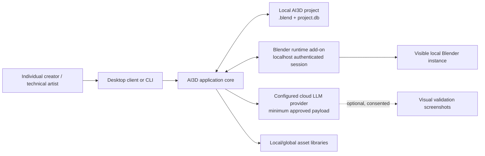
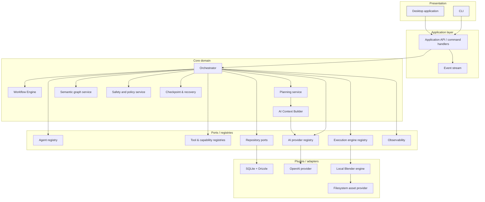
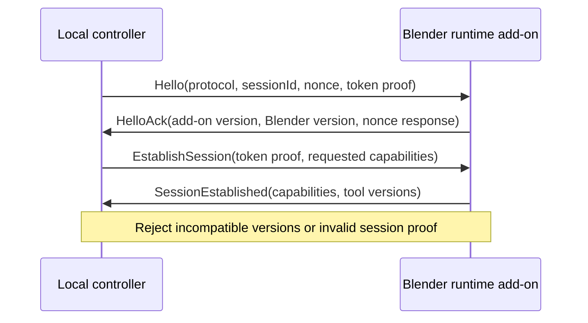
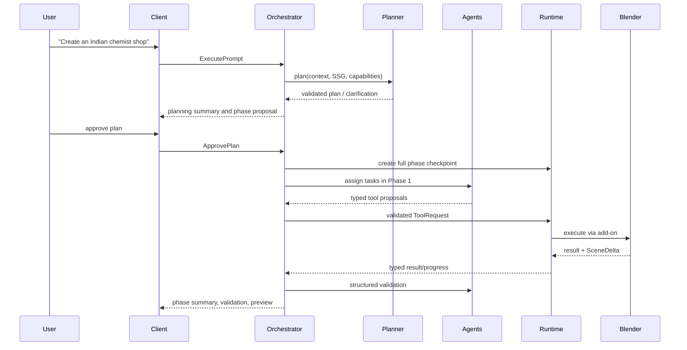
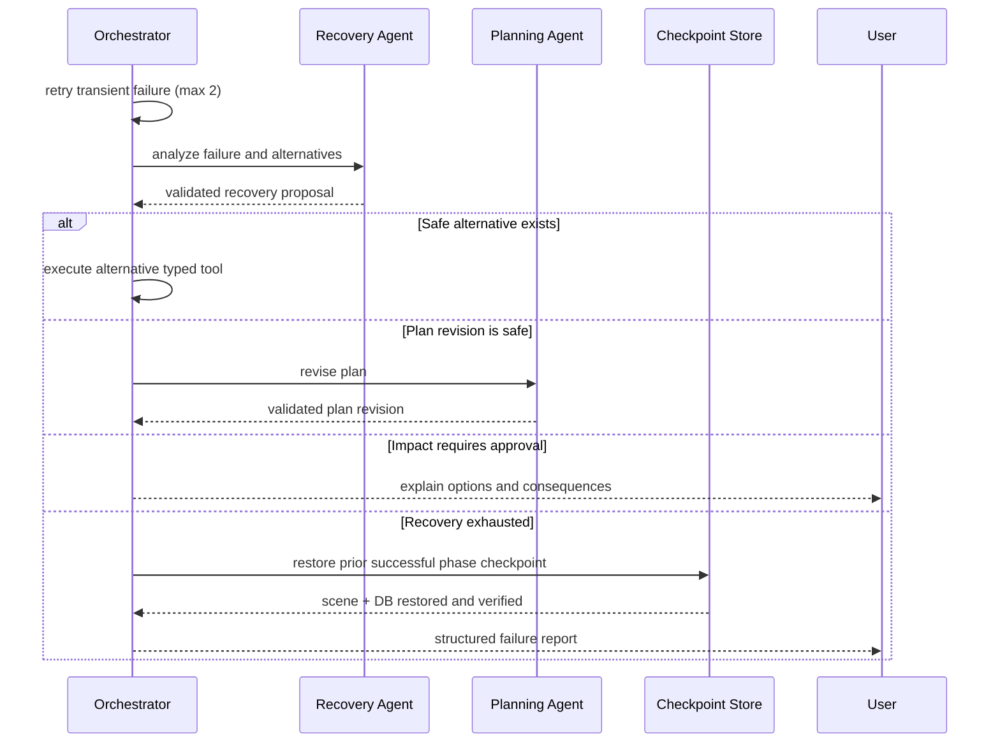
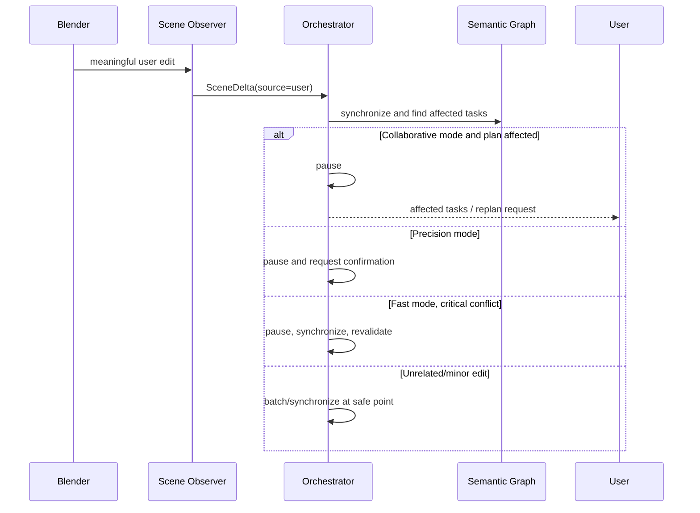
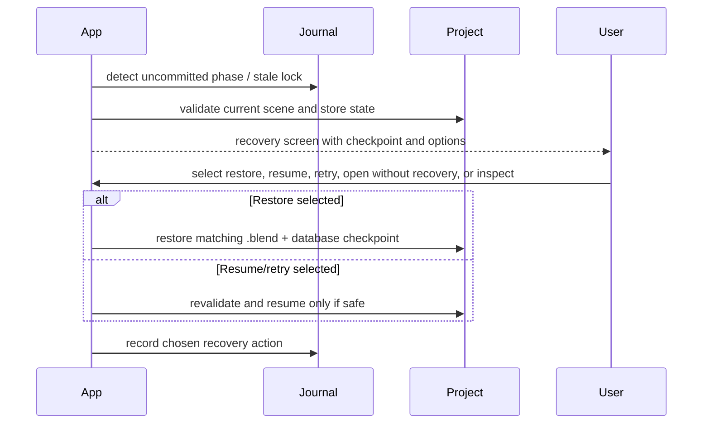

# AI3D Studio — Version 1 Software Architecture Specification

**Status:** Proposed baseline  
**Scope:** Version 1, Windows local desktop product, Blender 5.1 LTS (or the selected stable supported release)  
**Implementation status:** Architecture only; this document contains no implementation code.

## 1. Executive Summary

AI3D Studio is a local-first, production-grade AI-assisted 3D scene authoring platform. A user describes a scene or edit in natural language; AI plans a phase-based task graph, specialized agents propose typed operations, a deterministic orchestrator validates and schedules them, and a bundled Blender runtime add-on executes approved operations in the visible active Blender session.

Blender is the Version 1 execution engine and the source of truth for 3D data. The `.ai3d` project store is the source of truth for AI knowledge, execution history, semantic understanding, provenance, checkpoints, and recovery. All business logic is engine-, transport-, provider-, client-, and storage-abstraction driven. Version 1 is intentionally single-machine and single-writer, but its contracts permit additional DCC engines, remote workers, cloud services, and clients without changing the core domain.

## 2. Vision and Design Philosophy

- **Intent over meshes:** planners reason about semantic objects, functions, constraints, and goals—not Blender object names or `bpy` calls.
- **LLMs propose; trusted services verify; runtimes execute.** Free-form model output never reaches execution.
- **Local-first and privacy-first:** cloud AI is explicit, minimized, and provider-configured; projects and diagnostics stay local by default.
- **Human control scales with risk:** default collaboration is phase approval; destructive actions always require confirmation.
- **Transactional editing:** each approved phase either commits as a complete project state or restores the preceding checkpoint.
- **Plugin-oriented core:** all engines, agents, providers, validators, storage implementations, and tools are plugins internally, though Version 1 ships first-party plugins only.
- **Replaceable infrastructure:** SQLite, OpenAI, WebSocket/IPC, and Blender are adapters—not domain dependencies.

## 3. Functional Requirements

Version 1 shall:

1. Create, open, convert, save, export, package, and reopen `.ai3d` projects containing a `.blend`, SQLite database, manifest, assets, checkpoints, logs, cache, and exports.
2. Accept natural-language scene creation and follow-up modification requests; preserve and edit the existing scene rather than rebuilding it by default.
3. Ask confidence-based clarification questions; provide assumptions and a phase plan before execution.
4. Support Fast, Collaborative (default), and Precision execution modes; expose pause, resume, cancellation, progress, logs, and approvals.
5. Execute typed tools for the agreed Version 1 scene, object, transform, modifier, material, light, camera, collection, text, asset, and validation capabilities.
6. Use Planning, Modeling, Asset, Material & Lighting, Validation, and Recovery agents, coordinated solely by the orchestrator.
7. Synchronize meaningful manual Blender changes automatically and provide manual re-indexing.
8. Perform structured validation after operations and optional, consent-controlled visual validation at milestones.
9. Recover safely through retries, alternative tools, plan revision, explicit approvals, checkpoints, rollback, crash recovery, and structured failure reports.
10. Index project and global local assets semantically; support linked and copied assets and package linked projects.
11. Provide the desktop client and lightweight CLI through the same application APIs.

Out of scope: multi-user collaboration, cloud execution, non-Blender engines, animation, simulation, character workflows, image/texture generation, online asset marketplaces, and public third-party plugin distribution.

## 4. Non-Functional Requirements

| Area           | Requirement                                                                                                                           |
| -------------- | ------------------------------------------------------------------------------------------------------------------------------------- |
| Platform       | Windows 11 primary; Windows 10 where feasible; one supported Blender version.                                                         |
| Responsiveness | UI never blocks; quick actions target <5s; medium 5–30s; long tasks report progress continuously.                                     |
| Reliability    | Single writer, transactional phase execution, full checkpoints, explicit crash recovery.                                              |
| Security       | OS-backed secrets, localhost-only authenticated runtime session, typed allowlisted operations.                                        |
| Privacy        | Minimum required cloud payloads; screenshots opt-in; telemetry disabled by default.                                                   |
| Quality        | ~80%+ business-logic unit coverage plus integration, runtime, E2E, recovery, security, compatibility, and acceptance tests.           |
| Cost           | Track tokens and estimated spend; enforce configurable limits and warnings.                                                           |
| Extensibility  | Versioned contracts and plugins; no core dependency on a concrete provider, engine, client, transport, or persistence implementation. |

## 5. System Context Diagram



The diagram makes the boundaries explicit: Blender owns scene geometry; AI3D owns project intelligence; the cloud is an optional inference dependency, never a project store.

## 6. Overall Architecture



## 7. Clean / Layered Architecture

### Layers

| Layer                 | Purpose                                                             | May depend on                     |
| --------------------- | ------------------------------------------------------------------- | --------------------------------- |
| Presentation          | Desktop/CLI input, view models, subscriptions                       | Application contracts only        |
| Application           | Commands, queries, transaction boundaries, event publication        | Domain ports and domain services  |
| Domain                | Policies, state machines, semantic graph, task graph, value objects | Domain abstractions only          |
| Plugin/Infrastructure | SQLite, OpenAI, filesystem, Blender engine, transport               | Domain/application contracts      |
| Runtime               | Blender add-on, Blender Python API                                  | Runtime protocol and Blender APIs |

### Dependency Rules

1. Dependencies point inward. Domain packages never import Electron, Tauri, CLI, Drizzle, OpenAI SDK, transport, filesystem, or Blender APIs.
2. Clients call application services; they do not directly query repositories or runtimes.
3. Agents do not call other agents, Blender, or filesystem APIs. They return validated proposals through the orchestrator.
4. Tools are typed and capability-addressed; no generic operator or script execution tool exists.
5. Runtime add-on code is thin: command dispatch, observation, metadata extraction, progress, and structured errors only.
6. Cross-plugin interaction occurs through versioned contracts and registries, not concrete imports.
7. Publishers depend only on the typed event-bus contract; subscribers cannot influence the originating command's transaction or control flow.

## 8. Monorepo Structure

```text
ai3d-studio/
  apps/
    desktop/                 presentation client (framework selected later)
    cli/                     automation and test client
  packages/
    contracts/               public internal schemas, events, protocol types
    domain/                  policies, entities, value objects, state machines
    application/             commands, queries, use cases, orchestration facade
    orchestrator/            scheduler, task graph, approvals, lifecycle
    workflow-engine/         execution state machines, dependencies, retries, pause/resume
    event-bus/               typed in-process event publication and subscriptions
    ai-context-builder/      scoped, minimized, versioned model-context assembly
    observability/           traces, metrics, cost accounting, structured logging
    semantic-graph/          graph service and repositories
    memory/                  scoped memory service
    project-store/           project lifecycle, repositories, migrations
    checkpoints/             snapshots, restore, retention, journal
    assets/                  indexing, semantic search, packaging
    plugins/                 manifests, discovery, lifecycle, compliance
    ai-gateway/              provider abstraction, routing, cost, redaction
    prompts/                 versioned prompt assets and prompt resolution
    runtime-protocol/        controller/add-on messages and handshake
    test-kit/                fixtures, contract suites, fault injection
  plugins/
    agent-planning/
    agent-modeling/
    agent-assets/
    agent-material-lighting/
    agent-validation/
    agent-recovery/
    engine-blender-local/
    provider-openai/
    storage-sqlite/
    assets-filesystem/
  runtimes/
    blender-addon/           Python Blender runtime only
  docs/
    architecture/
    adr/
    contracts/
    runbooks/
  tests/
    e2e/
    acceptance/
    performance/
```

## 9. Package Responsibilities

| Package              | Purpose / public interface                                                     | Internal components                                                                   | Extensibility                             |
| -------------------- | ------------------------------------------------------------------------------ | ------------------------------------------------------------------------------------- | ----------------------------------------- |
| `contracts`          | versioned command, query, event, agent, tool, plugin, and runtime schemas      | validators, compatibility helpers                                                     | additive versioning; no infrastructure    |
| `domain`             | business entities and policies                                                 | task states, risk classification, value objects                                       | stable vocabulary across engines          |
| `application`        | `executePrompt`, `openProject`, `checkpoint`, `restore`, `package`, query APIs | command handlers, unit-of-work coordination                                           | reusable from desktop, CLI, web           |
| `orchestrator`       | lifecycle and scheduling interface                                             | dependencies, retries, approvals, cancellation                                        | future parallel/distributed scheduler     |
| `workflow-engine`    | execution workflow and state-machine contract                                  | dependency evaluator, retry policy, pause/resume/cancel state transitions             | durable/distributed workflow runner later |
| `event-bus`          | typed event publication/subscription contract                                  | dispatcher, subscriptions, delivery diagnostics                                       | durable/remote broker adapter later       |
| `ai-context-builder` | assemble minimized, authorized model context                                   | scoped retrieval, relevance selection, redaction, token budgeting, disclosure records | embeddings/retrieval strategies later     |
| `observability`      | tracing, metrics, cost accounting, structured logging interfaces               | correlation propagation, local metric aggregation, redaction, export controls         | OpenTelemetry/remote exporters later      |
| `semantic-graph`     | graph queries and mutations                                                    | relational repository adapter                                                         | future graph database adapter             |
| `ai-gateway`         | model invocation/routing/cost API                                              | redaction, consent gate, structured-output repair                                     | new providers/models/routing policies     |
| `prompts`            | versioned prompt asset resolution                                              | prompt catalog, metadata, compatibility and evaluation links                          | remote/signed prompt catalogs later       |
| `project-store`      | project/repository interfaces                                                  | SQLite migrations, manifest handling                                                  | PostgreSQL/cloud storage later            |
| `checkpoints`        | create/restore/list/retain snapshots                                           | journal, atomic staging, integrity checks                                             | delta/CAS storage later                   |
| `assets`             | search/import/relink/package interfaces                                        | indexer, thumbnail worker, metadata pipeline                                          | Browser/company/online providers          |
| `plugins`            | discovery/activation/capability interface                                      | dependency resolver, compliance checks                                                | public SDK later                          |
| `runtime-protocol`   | transport-neutral messages                                                     | session state, encoder/decoder                                                        | named pipe/remote transports              |
| Blender add-on       | execution host contract                                                        | dispatcher, observer, metadata collector                                              | version adapters per Blender release      |

## 10. Domain Model

Core aggregates are:

- **Project:** manifest, project state, runtime bindings, active lock, settings.
- **Execution:** prompt, plan revision, phase/task graph, mode, approvals, journal, status.
- **Semantic World:** semantic nodes, edges, properties, constraints, goals, object passports.
- **Checkpoint:** immutable complete snapshot, retention class, integrity state, restore record.
- **Asset:** source, identity/hash, import strategy, metadata, dependencies, license.
- **Plugin:** manifest, provided capabilities, dependencies, activation state.
- **AI Request:** scoped context, consent, routing decision, token/cost result.

Important value objects include `ProjectId`, `ExecutionId`, `PhaseId`, `TaskId`, `ToolId@Version`, `CapabilityId`, `ObjectId`, `CheckpointId`, `PluginId@Version`, `SchemaVersion`, `RiskLevel`, and `OwnershipState`.

## 11. Semantic Scene Graph / World Model Design

### Purpose and responsibilities

The Semantic Scene Graph (SSG) is the AI knowledge model. It represents meaning, goals, functional areas, spatial and functional relationships, constraints, provenance links, and task rationale. It never duplicates Blender geometry.

### Public interface

- `resolveSemanticObject(reference)`
- `findNodeByRole(role)`
- `findAdjacentNodes(node, relation)`
- `findObjectsNear(node, spatialRule)`
- `getFunctionalArea(node)`
- `queryConstraints(target)`
- `applyObservedSceneDelta(delta)`
- `validateGraphConsistency()`

### Internal components and data flow

Scene Observer emits a normalized delta → Identity Service resolves Blender object IDs → SSG projector updates nodes/edges/properties/provenance links → constraint validator checks invariants → orchestrator receives affected task analysis.

Nodes have roles (for example `Counter`, `MedicineRack`), not merely Blender types. Edges include `inside`, `adjacent_to`, `contains`, `belongs_to`, `connected_to`, and directional spatial relations. Constraints are explicit planning rules, such as “never modify” or “near entrance.” Nodes, edges, and constraints are independently versioned.

Future extensions include navigation, BIM, physics, animation, and gameplay semantics without changing domain APIs.

## 12. Object Passport & Provenance Model

### Purpose

An Object Passport protects user work and makes AI decisions explainable.

### Model

| Field                  | Meaning                                                                        |
| ---------------------- | ------------------------------------------------------------------------------ |
| `object_id`            | stable platform identity                                                       |
| `origin`               | AI generated, user created, imported asset, existing scene, procedural, plugin |
| `ownership`            | AI managed, user managed, shared                                               |
| `created_by/at`        | actor and timestamp                                                            |
| `last_modified_by/at`  | latest meaningful actor/change                                                 |
| `last_ai_task_id`      | traceability to task and phase                                                 |
| `version`              | optimistic revision                                                            |
| `manual_edit_detected` | safety and planning signal                                                     |

Origin is immutable. Ownership is mutable: meaningful user edits usually make an AI-managed object `Shared`. Safety policy permits planned AI changes to AI-managed objects, requires approval for material shared changes, and always requires approval for deletion/replacement of user-managed objects.

## 13. Identity Service Design

### Purpose / interface

The Identity Service maintains stable correspondence between runtime objects and project records: `assignIdentity`, `resolveIdentity`, `reconcile`, `detectDeleted`, and `recoverIdentity`.

### Design

Each managed Blender object stores only `ai3d.objectId` (and optional schema version) as immutable custom property. The project store owns all passport and semantic metadata. Synchronization matches IDs first; names and paths are never primary identity. If an ID is lost, heuristic reconstruction uses geometry, hierarchy, location, name, and collection membership. Low-confidence recovery requires user confirmation.

## 14. Memory Architecture

| Scope                   | Contents                                                 | Cloud policy                                      |
| ----------------------- | -------------------------------------------------------- | ------------------------------------------------- |
| Project memory          | conversation, plans, SSG, constraints, history, recovery | minimum relevant content only                     |
| Global preferences      | provider/model/mode/style/scale/UI/library preferences   | configuration, not reasoning context by default   |
| Cross-project learnings | opt-in local patterns, templates, statistics             | never included automatically; per-request consent |

The Memory Service requires callers to request a named scope. It returns selected, minimized context and records disclosures. Users can inspect, edit, delete, or disable cross-project learning.

## 15. AI Gateway Architecture

### Purpose and public interface

`invokeStructured(request)`, `estimateCost`, `route`, `validateConsent`, `redact`, and `recordUsage` form the AI Gateway. It is the only domain-facing AI-provider port.

### Internal flow

Agent declares response schema and required memory scope → gateway performs privacy/consent and payload minimization → routing policy selects configured provider/model → provider returns response → schema repair/retry occurs if necessary → semantic and business validators run → usage/cost is persisted.

OpenAI is the initial plugin. Provider selection is configuration-driven; future Claude, Gemini, OpenAI-compatible, Ollama, and vLLM implementations satisfy the same port. API keys are accessed through the secret store, never repositories or logs.

### AI Context Builder

The `ai-context-builder` package is responsible for assembling model context; agents and the AI Gateway must not concatenate prompts, conversation, scene data, or memory directly. Its public interface is `buildContext(request)`, where the request names the agent purpose, required memory scopes, prompt asset/version, project/execution reference, token budget, and requested visual inputs.

Internally it performs scoped retrieval, relevance ranking, structured scene summarization, payload minimization, redaction, consent checks, token budgeting, and disclosure recording. It returns a typed context manifest: selected prompt asset/version, included sources, omitted/truncated sources, estimated tokens, provider disclosure, and the final ordered model-input parts. Project memory remains isolated; global preferences are configuration; cross-project learnings require explicit per-request cloud consent. This keeps the existing privacy model enforceable and makes every model decision reproducible.

### Prompt Assets and Prompt Versioning

Prompts are first-class, immutable versioned assets in `packages/prompts`, not string literals distributed through agents. A prompt asset declares a stable prompt ID, semantic version, purpose/agent compatibility, input schema, output schema reference, variables, safety/privacy classification, change notes, and test/evaluation links. A plan, agent run, validation report, and recovery proposal records the exact prompt ID and version used.

The Prompt Catalog resolves only compatible approved versions. Updating a prompt creates a new version; it never changes the historical behavior record. Version 1 stores bundled first-party prompt assets and may persist the selected version in project execution history. Prompt migrations are explicit; remote catalogs, signing, A/B experimentation, and user-authored prompts are deferred.

## 16. Planner Architecture

The Planning Agent understands the request, current SSG, constraints, capability catalog, approved preferences, and limited project memory. It produces a versioned `PlanningAgentResponse` containing a planning summary, clarifications, assumptions, goals, phases, semantic tasks, dependencies, estimates, risks, and requested approvals.

It uses confidence-based clarification: critical missing constraints block planning in Collaborative mode; important constraints become disclosed defaults; minor details use defaults. Fast mode proceeds more readily; Precision mode gathers complete requirements. The planner cannot execute tools, mutate the scene, or coordinate retries. Replanning is a new, auditable plan revision linked to its predecessor.

## 17. Orchestrator Architecture

### Purpose

The orchestrator is the single coordinator and state-machine owner. It owns lifecycle, task graph, agent selection, scheduling, approvals, execution modes, retry progression, recovery invocation, event publication, cancellation, rollback coordination, and project synchronization.

### Workflow Engine

The `workflow-engine` package is the deterministic execution-control subsystem used by the orchestrator. It owns explicit workflow state machines, dependency readiness evaluation, retry/backoff policies, pause/resume/cancel transitions, timeout handling, and transition validation. Its public interfaces include `start`, `dispatchReadyWork`, `pause`, `resume`, `cancel`, `recordOutcome`, `retry`, and `getState`.

The orchestrator remains the policy and coordination owner: it selects agents, enforces approvals and safety, requests recovery/planning, and translates workflow outcomes into business decisions. The Workflow Engine never selects an agent, calls a model, mutates Blender, bypasses an approval, or performs rollback itself. It emits typed transition events through the Event Bus after committed journal changes. Version 1 is an in-process single-writer runner; the state-machine contract permits a future durable or distributed runner.

### Public interfaces

- Commands: `startExecution`, `approvePlan`, `approvePhase`, `pause`, `resume`, `cancel`, `resolveRecovery`, `rollbackPhase`.
- Queries: execution state, timeline, current phase/task, approvals, validation, recovery report.
- Events: lifecycle, task, tool, validation, synchronization, approval, checkpoint, recovery, cost, error.

### State model

`Draft → Clarifying → AwaitingPlanApproval → Checkpointing → ExecutingPhase → Validating → AwaitingPhaseApproval → Completed` with side paths `Paused`, `Recovering`, `RollingBack`, `Cancelled`, `Failed`, and `CrashInterrupted`. Only one active writer may transition a project.

### Event Bus

The `event-bus` package distributes typed, versioned domain and application events to presentation clients, timeline projection, logging, diagnostics, and other non-controlling subscribers. Its public interface is `publish(event)`, `subscribe(eventType, handler)`, and `unsubscribe(subscription)`. Version 1 uses an in-process asynchronous dispatcher with correlation IDs, ordered delivery within an execution stream, subscriber isolation, and delivery diagnostics.

The command path remains authoritative: an orchestrator command commits its state and execution journal first, then publishes an event. Subscribers are observers; they may issue a new command through the Application API but cannot mutate the active transaction or call the runtime directly. The durable execution journal—not ephemeral event delivery—is the recovery and audit source of truth. A future adapter may add a persisted outbox, remote streaming, or a broker without changing publishers or subscribers.

## 18. Runtime Architecture

`ExecutionEngine` is the engine-neutral port: discover, connect, negotiate, query capabilities, execute tool, observe scene, snapshot/restore, pause/cancel, and health-check. `LocalBlenderEngine` implements it through a transport-neutral runtime client.

Execution Controller owns session ownership, locks, pause/resume, cancellation, manual-intervention behavior, and synchronization. Planner and agents never receive an execution-mode or transport dependency. Remote workers later implement the same engine port and protocol semantics.

## 19. Blender Runtime Design

The bundled add-on is a thin authenticated runtime host inside the visible user Blender instance.

| Responsibility                                                                                                                          | Explicitly excluded                                                                      |
| --------------------------------------------------------------------------------------------------------------------------------------- | ---------------------------------------------------------------------------------------- |
| receive typed requests, dispatch tools, observe changes, collect metadata, stream progress/results/errors, advertise capability/version | planning, agents, memory, provider logic, tool selection, orchestration, business policy |

The controller discovers or launches Blender as a convenience, negotiates the add-on, and reconnects after restart. Blender-version-specific code is contained in the Blender adapter/add-on boundary.

## 20. Tool Registry

The Tool Registry exposes only allowlisted typed tools, each with an ID, semantic capability, version, input/output schema, validation rules, documentation, risk category, implementation binding, and compatibility constraints. Examples include `CreatePrimitive`, `MoveObject`, `AssignMaterial`, `ImportAsset`, `ApplyModifier`, `DeleteObject`, and `ValidateScene`.

Tool requests flow: agent proposal → schema validator → semantic/business/safety/capability validator → orchestrator → registry resolution → engine → runtime. There is no arbitrary `bpy` or generic “execute operator/script” tool. Future plugins add typed tools through the same manifest model.

## 21. Capability Registry

The Capability Registry answers what an active engine and enabled plugins can safely do. It contains capability IDs, versions, tool providers, required engine/runtime/add-on versions, risk level, supported contexts, and deprecation state. Planning and recovery reason over capabilities; registry resolution selects a compatible tool at execution time. This permits semantically equivalent alternatives and future engine mappings.

## 22. Plugin Architecture

### Contract

Each internal plugin declares `id`, `version`, dependencies, configuration schema, capabilities, services, lifecycle hooks, compatibility constraints, and health status. Lifecycle is discover → validate manifest → resolve dependencies → activate → register → health-check → deactivate.

### Version 1 plugin classes

- agent, engine, tool provider, validator, AI provider, storage provider, asset provider.

Core only imports plugin contracts. A compliance suite verifies metadata, activation/deactivation, capability discovery, and errors. Version 1 does not provide public installation, signing, sandboxing, SDK, or marketplace; these are future concerns.

## 23. Asset System

### Purpose / interfaces

The Asset Service exposes `addLibrary`, `index`, `search`, `inspect`, `import`, `relink`, `packageProject`, and `verifyDependencies`. Planner and agents never search the filesystem directly.

### Data flow

Project/global source configuration → async indexer → format inspection/thumbnail extraction → optional AI semantic tagging with approved minimal data → SQLite metadata and search index → semantic query → import strategy → project/SSG/provenance updates.

Assets may be linked (development default) or copied (portable). Package Project copies linked assets, updates references, and verifies dependencies. Metadata includes identity, hashes, dimensions, material/polygon count, style/tags, compatibility, source, license, author, preview, and AI/user tags. The provider boundary supports Blender Asset Browser, company servers, and online providers later.

## 24. Project Store Design

Each `.ai3d` directory has `scene.blend`, `project.db`, manifest, asset area, logs, cache, checkpoints, and exports. The Project Store provides repositories and transactions for project metadata, conversation, execution journal, plans/tasks, SSG, passports, assets, checkpoints, settings, memory, and migrations.

Blender is authoritative for geometry and native scene data; project storage is authoritative for derived AI information. Changes are synchronized in batches of meaningful operations. An application-level global SQLite database stores recent projects, libraries, installed plugin metadata, preferences, provider configuration metadata, and optional learnings.

## 25. SQLite Schema

The following normalized logical schema is Version 1’s baseline. Exact physical migrations remain implementation work.

| Domain                 | Core tables                                                                                                                                                               |
| ---------------------- | ------------------------------------------------------------------------------------------------------------------------------------------------------------------------- |
| Project                | `projects`, `project_settings`, `project_manifest_history`, `project_locks`                                                                                               |
| Conversations/memory   | `conversations`, `messages`, `memory_items`, `memory_disclosures`, `cross_project_learnings`                                                                              |
| Prompts/context        | `prompt_assets`, `prompt_versions`, `prompt_evaluations`, `context_manifests`, `context_disclosures`                                                                      |
| Plans/execution        | `plans`, `plan_revisions`, `phases`, `tasks`, `task_dependencies`, `task_attempts`, `approvals`, `execution_journal`, `execution_events`, `tool_executions`, `cost_usage` |
| Semantic graph         | `semantic_nodes`, `semantic_edges`, `semantic_properties`, `semantic_constraints`, `semantic_versions`                                                                    |
| Identity/provenance    | `object_passports`, `object_versions`, `identity_recovery_candidates`                                                                                                     |
| Assets                 | `asset_libraries`, `assets`, `asset_metadata`, `asset_tags`, `asset_dependencies`, `asset_imports`, `asset_previews`                                                      |
| Validation/recovery    | `validation_reports`, `validation_findings`, `recovery_plans`, `recovery_attempts`, `failure_reports`                                                                     |
| Checkpoints/migrations | `checkpoints`, `checkpoint_artifacts`, `restores`, `migrations`, `migration_runs`                                                                                         |
| Plugins/runtime        | `plugin_installations`, `plugin_state`, `engine_sessions`, `runtime_capabilities`                                                                                         |

Foreign keys, transaction boundaries, checksums, creation/update times, schema versions, and useful query indexes are mandatory. The repository and SSG service hide SQLite and Drizzle details.

## 26. Checkpoint & Recovery System

### Checkpoint design

A full checkpoint is created before each approved phase, destructive operation, major planner revision, and explicit user request. It contains a complete `.blend` snapshot, SQLite backup, manifest/configuration, execution/task state, planner state, memory, and metadata. Automatic retention defaults to a configurable finite count (for example ten); manual checkpoints are retained unless removed.

### Recovery policy

1. Retry temporary failures twice with exponential backoff and journaling.
2. Ask Recovery Agent for semantic alternative tool proposals.
3. Ask Planning Agent for a versioned revised plan when appropriate.
4. Require explicit confirmation for high-impact or irreversible actions.
5. On unrecoverable failure, restore last successful checkpoint and publish a structured report.

The Checkpoint Store is an abstraction; Version 1 uses complete local snapshots. Future implementations may use deltas, CAS, or cloud storage.

## 27. Migration System

Opening an incompatible project detects versions, computes required ordered migrations, presents a summary, requests approval, creates a pre-migration full checkpoint, runs idempotent deterministic migrations, validates, and opens. Any failure stops the run and restores the checkpoint.

Independent migration tracks cover project format, SQLite schema, runtime protocol, plugin metadata, assets, SSG, and provenance. Forward migration is guaranteed; backward migration is not required because restoration is safe. All runs are logged and testable.

## 28. Session & Lock Manager

A project grants exactly one active writer/execution lease. The owner may edit project state, synchronize Blender, checkpoint/restore, migrate, and execute. Other desktop or CLI clients may open read-only for inspection. The lock records owner, acquisition time, liveness, and session identity. On apparent stale ownership, Recovery Manager validates process liveness and enters the crash recovery workflow before granting a new writer lease.

## 29. Security Architecture

- Store API keys in Windows Credential Manager; encrypted local fallback only if unavailable. Never include secrets in project files, logs, telemetry, crash reports, or screenshots.
- Bind runtime transports to localhost only and create a memory-only cryptographically random session token.
- Require handshake nonce/session validation and capability/version negotiation; reject unknown, expired, malformed, or incompatible requests.
- Validate every agent proposal and every tool request through schema, semantic, business, safety, and runtime-capability gates.
- Allowlist typed tools; no arbitrary operators, scripts, or external downloads.
- Treat destructive actions as policy-gated approvals based on object passport ownership and change impact.
- Validate plugins through manifests and first-party compliance tests. Third-party plugin trust/sandboxing is deferred.

## 30. Privacy Model

Nothing leaves the computer unless needed for an explicitly configured AI task. `.blend` files are never uploaded automatically. Planning sends only prompt, relevant conversation, approved project metadata, and needed semantic context. Visual material is sent only when visual validation is enabled and the user’s screenshot policy allows it: never, ask every time, or always allow. Telemetry is off by default; crash reports/logs are local until manually reviewed and exported. Cross-project learning requires per-request cloud consent.

## 31. Communication Protocols

The transport port supports local WebSocket, local HTTP, named pipes, or local IPC; Version 1 selects one implementation without changing application code. It is request/response plus event streaming, localhost-bound, authenticated, and versioned. Transport encryption is not required locally under the same OS account; remote implementations will add mutual TLS or equivalent.

### Handshake sequence



## 32. Runtime Message Schemas

Messages are versioned envelopes, validated at both ends, correlated by request ID, and idempotency-keyed where a retry could duplicate effects.

| Message                     | Required conceptual fields                                                             |
| --------------------------- | -------------------------------------------------------------------------------------- |
| `Hello v1`                  | protocol version, session ID, controller nonce, token proof                            |
| `HelloAck v1`               | runtime/add-on/Blender versions, nonce response, endpoint identity                     |
| `Capabilities v1`           | engine ID, tool/capability IDs and versions, limits                                    |
| `ToolRequest v1`            | request/correlation/idempotency IDs, tool ID/version, typed payload, execution context |
| `ToolProgress v1`           | request ID, stage, percent/indeterminate state, safe detail                            |
| `ToolResult v1`             | request ID, status, typed output, observed changes, warnings                           |
| `RuntimeError v1`           | code, category, retryability, safe message, diagnostic reference                       |
| `SceneDelta v1`             | operation batch, object IDs, changes, source AI/user/unknown, timestamp                |
| `SnapshotRequest/Result v1` | checkpoint ID, artifact location/reference, checksum                                   |
| `Health v1`                 | state, active session, version compatibility, heartbeat                                |

No message contains raw code or unrestricted Blender operator names.

## 33. Major Workflow Sequence Diagrams

### Prompt to approved phase execution



### Failure and rollback



### Manual edit during execution



### Crash recovery



## 34. Error Handling Strategy

Errors use typed categories: validation, safety/policy, capability/compatibility, transient infrastructure, deterministic tool failure, asset dependency, checkpoint/recovery, migration, and user cancellation. Each error includes correlation IDs, safe user explanation, retryability, remediation options, diagnostics reference, and causal chain. Errors never expose secrets or raw untrusted provider content.

The orchestrator is the only layer that translates errors into retries, recovery requests, rollback, or user approvals. A failed phase never silently commits partial AI project state. Runtime errors are structured, and provider output failures are repaired/retried before they are represented as execution proposals.

## 35. Logging Strategy

The `observability` package owns tracing, metrics, cost tracking, and structured logging contracts. It propagates correlation IDs across project, execution, phase, task, tool request, runtime session, provider request, checkpoint, recovery run, prompt version, and context manifest. Its public interface includes `startSpan`, `recordMetric`, `recordCost`, `log`, and query/export functions for approved local diagnostics.

Version 1 aggregates data locally. Traces describe causality and duration; metrics describe latency, reliability, queue/dependency state, runtime health, checkpoint/recovery timings, asset indexing, and resource use; cost records capture provider/model, token usage, estimate/actual cost, budget impact, and associated execution. Cost tracking is centralized here rather than split between the gateway and ad hoc logs; the AI Gateway emits normalized usage to Observability after each provider result.

Use structured local logs with correlation IDs spanning project, execution, phase, task, tool request, runtime session, provider request, checkpoint, and recovery run. Maintain:

- user-facing execution timeline (safe summaries),
- durable execution journal (transaction/recovery facts),
- diagnostic logs (local, redacted), and
- auditable decision records (plan revisions, approvals, tool and validation outcomes).

Retention is configurable. Secret values, raw credentials, and unapproved payloads are never logged. Users export selected diagnostics manually after reviewing their contents.

## 36. Testing Strategy

| Layer           | Required verification                                                                                                  |
| --------------- | ---------------------------------------------------------------------------------------------------------------------- |
| Unit            | ~80%+ business logic: planner validators, task graph, recovery policy, graph, repositories, plugins, config, utilities |
| Integration     | planner→orchestrator, runtime→engine, assets→SQLite, plugins→runtime, checkpoints→recovery                             |
| Blender runtime | connect, negotiation, dispatch, observation, metadata, streaming, restart/recovery on supported Blender                |
| E2E             | create → plan → execute → validate → save → reopen → modify → checkpoint → rollback → continue                         |
| Fault injection | Blender/app crash, timeout, network/tool/planner errors, checkpoint corruption, interrupted execution                  |
| Compatibility   | application/add-on/Blender/protocol/project-format combinations                                                        |
| Performance     | startup, latency, memory, indexing, checkpoint/recovery, large project loading                                         |
| Security        | key protection, localhost/authentication, privacy, permissions, plugin and recovery safety                             |
| Acceptance      | bedroom, chemist shop, office, restaurant, living room scenarios                                                       |

The test kit owns deterministic fixtures, fake providers/engines, contract suites, time controls, and failure injectors. Live-cloud tests are isolated, opt-in, budget-limited, and never the sole release gate.

## 37. Deployment Architecture

Version 1 ships a standard Windows MSI or EXE installer. It installs the desktop app, CLI, Start Menu shortcuts, `.ai3d` association, first-run directories, and bundled Blender add-on—not Blender itself. First run detects supported Blender installations, lets users select one, installs/enables/verifies the add-on, and remembers the choice. The app manages compatible add-on updates and prompts before application updates; updates never interrupt active work.

Offline installation and local project creation/indexing work without an account or network. Internet is needed only for configured cloud inference, optional update checking, or future optional asset downloads.

## 38. Versioning Strategy

SemVer applies independently to application, plugins, tool/capability contracts, runtime protocol, add-on, project format, SQLite schema, SSG schema, asset metadata, object provenance, and prompt assets. Compatibility negotiation declares supported ranges rather than assuming equality. Contracts are additive where possible; breaking changes require a new version and explicit migration/adapter. Deprecation windows are documented for internal plugins before removal.

## 39. Coding Standards

- TypeScript is strict and domain code is side-effect free where possible; Python is confined to the Blender runtime boundary.
- Contract schemas are the source of truth for cross-package/runtime data; validate at every boundary.
- Favor small cohesive modules, explicit dependency injection, immutable command/result values, and exhaustive state handling.
- No ambient globals, hidden I/O, untyped `any`, direct SQL outside repository adapters, or direct provider/runtime calls from domain services.
- All operations need cancellation, timeout, correlation, structured errors, and observability appropriate to their boundary.
- Security/privacy review is required for new providers, transports, tools, plugins, and data disclosures.

## 40. Naming Conventions

| Concern             | Convention                                                                                     |
| ------------------- | ---------------------------------------------------------------------------------------------- |
| TypeScript packages | `@ai3d/<kebab-case>`                                                                           |
| Plugin IDs          | `ai3d.<kind>.<name>` (for example `ai3d.engine.blender-local`)                                 |
| Tool/capability IDs | namespaced Pascal semantic name plus explicit version (for example `scene.CreatePrimitive@v1`) |
| Commands/events     | imperative Pascal command / past-tense Pascal event (`ExecutePrompt`, `PhaseCompleted`)        |
| Database            | plural `snake_case` tables, singular `*_id` keys                                               |
| IDs                 | opaque UUID/ULID values, never names as identity                                               |
| Runtime messages    | Pascal schema names with `vN` version suffix                                                   |
| Files/folders       | lowercase kebab-case except conventional project artifacts                                     |

## 41. Architecture Decision Records

Keep one concise ADR per irreversible or cross-cutting choice in `docs/adr/` with context, decision, alternatives, consequences, status, owner, date, and links to contracts/migrations.

Initial ADRs:

1. Local-first single-writer desktop architecture.
2. Blender add-on as thin active-session execution host.
3. Typed allowlisted tool catalog; no arbitrary Blender operators.
4. Full snapshots for phase checkpoints.
5. SQLite plus Drizzle behind repositories.
6. Hybrid object identity using `ai3d.objectId` custom property.
7. Relational persistence for semantic graph.
8. Provider-neutral AI Gateway with OpenAI initial implementation.
9. Plugin-oriented internal runtime; no public plugin ecosystem in Version 1.
10. Explicit approved project migrations.
11. AI Context Builder is the sole model-context assembly boundary.
12. Workflow Engine owns deterministic state transitions; orchestrator owns policy.
13. Prompts are immutable versioned assets with execution-level provenance.
14. Observability is a cross-cutting package with local-first trace, metric, cost, and log storage.

## 42. Risks and Mitigations

| Risk                             | Mitigation                                                                                    |
| -------------------------------- | --------------------------------------------------------------------------------------------- |
| LLM creates unsafe/invalid plans | versioned schemas; semantic/business/safety validation; typed tool catalog; approvals         |
| Blender UI/context sensitivity   | thin runtime adapter; capability checks; deterministic tool design; runtime integration tests |
| Partial scene/state mismatch     | full phase checkpoint, journal, atomic restore of `.blend` and DB                             |
| Manual edit conflicts            | observer, provenance, ownership, SSG delta analysis, mode-aware pausing                       |
| Snapshot disk growth             | configurable automatic retention; manual checkpoint policy; future deduplication              |
| Cloud cost/privacy surprise      | cost tracking/limits; minimum payloads; consent gates; local logging                          |
| Plugin/version incompatibility   | manifests, negotiation, compatibility ranges, compliance tests, explicit migrations           |
| Asset path loss                  | linked/copy metadata, hashes, relink flow, package operation                                  |
| Runtime endpoint abuse           | localhost only, memory token, nonce handshake, protocol validation                            |
| Scope expansion delays release   | capability allowlist, first-party plugins, Version 1 exclusions, phased roadmap               |

## 43. Deferred Version 2+ Features

Non-Blender engines; macOS/Linux; remote and distributed execution; cloud rendering; multi-user collaboration; public SDK/plugins/marketplace; signed/sandboxed plugins; online assets; animation, characters, rigging, sculpting, simulation, nodes, UV/texture painting, compositing; delta checkpoints; branching history; team/organization memory; enterprise auth and policy; public web client; rendering farm; advanced visual QA and autonomous iterative optimization beyond configured limits.

## 44. Development Roadmap

1. **Foundation:** contracts, strict domain/application boundaries, plugin loader, SQLite project store, manifest, locks, event bus, Observability, prompt catalog, AI Context Builder, Workflow Engine, and CLI skeleton.
2. **Blender connectivity:** add-on lifecycle, local authenticated protocol, negotiation, scene query/observer, metadata and identity assignment.
3. **Safe execution kernel:** capability/tool registries, typed core tools, execution controller, phase state machine, approvals, structured validation.
4. **Project intelligence:** SSG, object passports, project memory, initial planning agent, OpenAI gateway, structured-response validation.
5. **Transactions and resilience:** snapshots, journal, rollback, recovery agent, crash recovery, migrations.
6. **Assets and presentation:** local indexing/search/import/relink/package; desktop experience for conversations, timeline, recovery, settings.
7. **Visual quality and hardening:** consent-controlled visual validation, cost controls, installer/updater/add-on compatibility, complete test matrix, performance/security review.

Each phase should leave the product runnable, testable, and demonstrably safe before adding more intelligence.

## 45. Definition of Done for Version 1

Version 1 is complete only when all of the following are true:

- A Windows user can install AI3D Studio, select a supported Blender installation, and have the add-on managed automatically.
- They can create or import a project safely, request a representative scene, approve a phased plan, observe visible Blender execution, and continue editing conversationally.
- Structured output, tool, capability, safety, provenance, and runtime checks gate every execution action.
- Collaborative mode’s plan/phase approvals, pause/cancel, logs, screenshots/previews, and manual-edit handling work reliably.
- Project store, SSG, provenance, assets, linked/copy/package behavior, SQLite migrations, and CLI share the same application APIs.
- Complete phase checkpoints, rollback, crash detection/recovery, and consistency restoration of `.blend` plus database are proven through automated fault tests.
- Supported Blender/add-on/application/protocol compatibility is verified and errors are clear.
- Security and privacy obligations are demonstrated: secrets protected, runtime authenticated/local-only, telemetry opt-in, cloud payloads minimized, screenshot consent respected.
- The automated and manual acceptance suites pass for the representative scenarios and normal/failure workflows.
- No deferred Version 2+ feature is required for safe Version 1 operation.

## 46. Architecture Review: Contradictions, Complexity, and Simplifications

### No material contradictions found

The requirements consistently preserve these boundaries: Blender owns scene data; the project store owns AI knowledge; the orchestrator owns control flow; agents own domain reasoning; tools own execution; the runtime hosts Blender operations; and the user controls high-impact changes. The local-first, cloud-inference-only model is compatible with optional visual validation because screenshots are explicitly consent-gated.

### Areas requiring deliberate interpretation

1. **“Autonomous Mode” vs named modes:** early requirements name Autonomous/Collaborative/Live Assistant, while later requirements define Fast/Collaborative/Precision. Resolve in ADR-001 by treating Fast as the renamed Autonomous execution policy and Live Assistant as a request-level interaction policy, not a conflicting scheduler mode. The user-facing naming must be finalized before UI work.
2. **Blender 5.1 LTS wording:** support exactly one explicitly pinned Blender build per application release; “or latest stable” must not mean automatic floating compatibility. Record the chosen build/range in the compatibility matrix.
3. **Visual validation and rendering optionality:** use viewport capture first; low-resolution render is an optional runtime capability. Do not make rendering success a completion dependency in Version 1.

### Potential overengineering and recommended Version 1 simplifications

| Area                | Recommendation                                                                                                                                                                |
| ------------------- | ----------------------------------------------------------------------------------------------------------------------------------------------------------------------------- |
| Plugin system       | Implement a static first-party manifest/registration loader; defer dynamic package discovery, isolation, signing, and hot reload. Preserve the contract, not the marketplace. |
| Multi-model routing | Start with one configured OpenAI model per responsibility and explicit settings. Keep routing interface but defer autonomous cost/performance optimization.                   |
| Semantic graph      | Implement roles, core spatial/functional edges, constraints, provenance links, and query APIs. Defer complex inference, graph algorithms, and broad ontology work.            |
| Asset AI metadata   | Start with deterministic metadata extraction plus optional one-time AI tagging. Defer embeddings/vector search until SQL/FTS semantic metadata is insufficient.               |
| Savepoints          | Full-copy snapshots and retention; defer compression, deduplication, branching, partial rollback, and time travel.                                                            |
| Transport           | Select one localhost transport and test it thoroughly. Keep port contracts; do not build multiple transports or remote worker support now.                                    |
| Visual QA           | Run at phase completion/final review or user request only. Do not create an unbounded autonomous improvement loop.                                                            |
| Engine abstraction  | Build only the `ExecutionEngine` and capability contracts needed by Blender. Do not prebuild Unreal/Unity adapters or engine-neutral geometry implementations.                |
| Client frameworks   | Keep the presentation port framework-free, but choose one desktop framework before implementation; supporting both Electron and Tauri in Version 1 adds no user value.        |

These simplifications retain the intended architectural seams while concentrating Version 1 on trusted, observable Blender execution.

---

**Approval gate:** This specification intentionally stops before repository scaffolding or implementation. No code or skeleton should be produced until explicitly approved.
